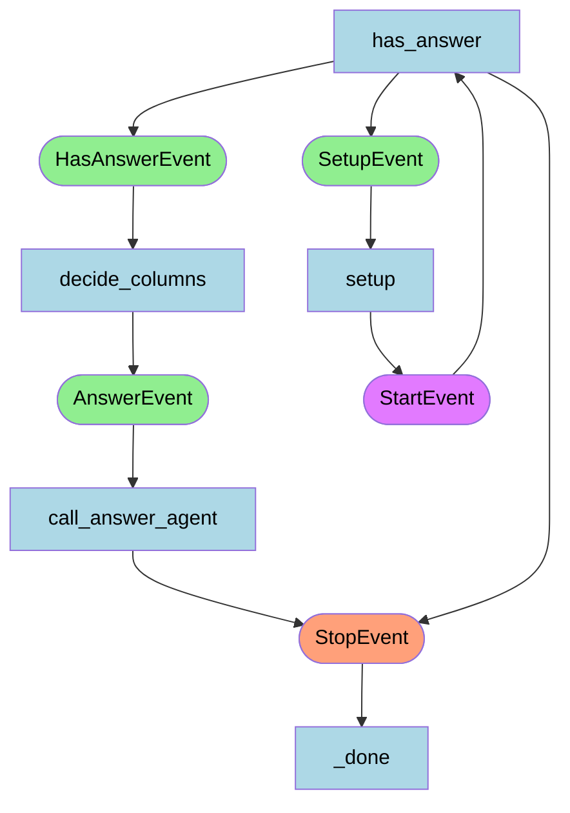

# PandasFlow 🐼

A multi-stage, LLM-powered workflow for advanced analysis and question answering over tabular data using Pandas and LlamaIndex. Instead of relying on direct code execution, which can be error-prone and require a separate sandbox, the system exposes controlled data manipulation tools to the agent for safe and reliable operations.

---

## Features
- **LLM-driven Data Analysis:** Uses OpenAI's GPT-4.1 (or any other LLMs) and LlamaIndex Workflow for intelligent question answering on CSV/tabular datasets.
- **Multi-step Workflow:** Modular agent workflow for setup, answerability check, column selection, and answer generation.
- **Tool Integration:** Built-in tools for correlation, filtering, and aggregation.
- **Observability:** Optional Langfuse instrumentation for tracing and monitoring agent execution.

---

## Architecture Diagram



This diagram visualizes the agent's event-driven workflow:

- **Nodes:** Represent agent steps (setup, has_answer, decide_columns, call_answer_agent, etc.)
- **Edges:** Show transitions between workflow states

---

## Installation

1. **Clone the repository:**
   ```bash
   git clone https://github.com/therealcyberlord/PandasFlow.git
   cd pandas-llamaindex-agent
   ```
2. **Install [uv](https://github.com/astral-sh/uv):**
   ```bash
   pip install uv
   ```
3. **Create a virtual environment (recommended):**
   ```bash
   uv venv
   source .venv/bin/activate
   ```
4. **Install dependencies with uv:**
   ```bash
   uv sync
   ```
5. **Set up environment variables:**
   - Copy `.env.example` to `.env` and set your OpenAI/Langfuse keys as needed.

---

## Usage

### Basic Example
```python
python main.py
```

This runs the agent on a sample query and CSV file. See `main.py` for a runnable example:
```python
async def main():
    w = PandasAgent(timeout=60, verbose=True)
    result = await w.run(query="what is the correlation between BMI and expenses?", file_name="data/insurance.csv")
    print(str(result))
```

### Custom Usage
You can provide your own data csv in `data/` directory. The agent will load the csv file from there. You can also configure this to point to an external source by modifying the `main.py` file.

---

## Agent Workflow

1. **Setup:** Loads the CSV file and generates metadata.
2. **Has Answer:** Uses LLM to determine if the question is answerable from the data.
3. **Decide Columns:** LLM selects relevant columns for further analysis.
4. **Call Answer Agent:** The answer agent is equipped with specialized tools:
    - **Pearson Correlation:** Computes correlation between columns.
    - **Filter Column:** Filters data based on conditions.
    - **Aggregate:** Performs aggregation operations (e.g., sum, mean, count).
   
   These tools enable the agent to reason about data, perform calculations, and answer complex natural language questions over tabular datasets.

Each step is implemented as an async workflow step. See [`main.py`](./main.py) for details.

---

## Customization
- **Add tools:** Implement new functions in `tools.py` and register with the agent.
- **Prompts:** Customize prompt templates in `prompts.py`.
- **Instrumentation:** Enable Langfuse by setting environment variables.